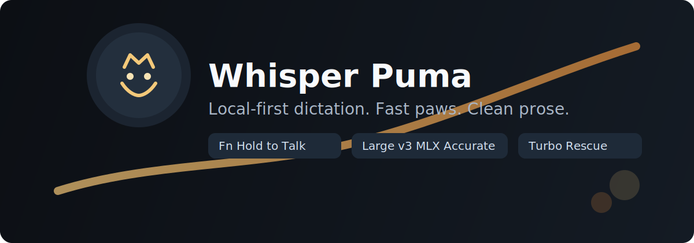

# Whisper Puma



[](CHANGELOG.md)
[](#required-permissions)
[](#how-it-works)
[](#why-whisper-puma)
[](LICENSE)

Whisper Puma is your local typing predator: press, speak, release, done.  
It stays private, it moves fast, and it tries to keep your natural voice instead of sanding it into generic AI text.

## Quick Links

- [Why Whisper Puma](#why-whisper-puma)
- [Quick Start](#quick-start)
- [How It Works](#how-it-works)
- [Puma Roadmap](#puma-roadmap)
- [Troubleshooting](#troubleshooting)

## Why Whisper Puma

- `Fn` is hold-to-talk by design, so you avoid accidental toggles and macOS key side effects.
- One public model policy: `mlx-community/whisper-large-v3-mlx` for stable, accurate local dictation.
- Hidden turbo rescue exists only for empty final decodes, not as the primary path.
- Spoken punctuation commands are deterministic, and long transcripts can run a bounded local polish pass (`qwen2.5:3b-instruct`, 250ms cap).
- Direct typing is first, clipboard fallback is second, and history is always captured in `~/.whisper_puma_history.log`.

## Install

```bash
git clone https://github.com/everfacture/whisper-puma.git
cd whisper-puma
pip install -r src/backend/requirements.txt
./scripts/build_app.sh
open build/WhisperPuma.app
```

## Required Permissions

1. Microphone: `System Settings -> Privacy & Security -> Microphone`
2. Accessibility: `System Settings -> Privacy & Security -> Accessibility`

If Accessibility is missing, Whisper Puma still gives you text via clipboard fallback.

## How It Works

```text
Fn Hold
  -> capture audio chunks
  -> stream to local backend (/stream)
  -> rolling partial decode (UX feedback)
  -> full-final decode (accuracy-first)
  -> deterministic format rules
  -> optional bounded local polish (<=250ms)
  -> direct typing
  -> clipboard fallback (if needed)
```

## Key Subsystems

- `Hotkey + Session Control`: stable press/release handling with Fn hold-only policy.
- `Transcription Engine`: `whisper-large-v3-mlx` primary, turbo rescue fallback only on empty final output.
- `Formatting`: spoken command parser plus optional bounded local LLM cleanup.
- `Insertion`: direct typing first with safe clipboard preservation fallback.
- `History + Metrics`: searchable history UI and latency badge (`last / p50 / p95`).

## Puma Roadmap

- `Next`: strengthen long-form punctuation/list fidelity without sacrificing sub-3s responsiveness.
- `Next`: improve named-entity consistency under background audio.
- `Soon`: context-aware style profiles (chat, notes, email, code).
- `Later`: multilingual mode while keeping the same local-first guardrails.

## Troubleshooting

- Empty transcript: verify mic permission and inspect `~/.whisper_puma_backend.log`.
- No paste: verify Accessibility permission; fallback copy still works.
- Fn behavior unexpected: Fn is intentionally hold-only in v1.2.0.

## Docs

- Spec: [docs/puma_spec.md](docs/puma_spec.md)
- Tasks: [docs/task.md](docs/task.md)
- Release Notes: [docs/release-notes-v1.2.0.md](docs/release-notes-v1.2.0.md)
- Changelog: [CHANGELOG.md](CHANGELOG.md)
